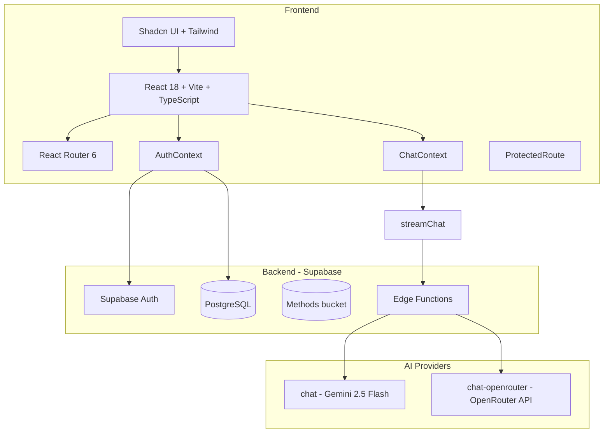

# Instant Web Chatter (Internium)

Internium is an AI‑powered educational platform built for Internium / Texel AI internship program. It combines:

- a **context‑aware AI mentor** (Gemini / OpenRouter),
- a **library of methods** (PDF materials in Supabase Storage),
- a **Yandex‑Practicum‑style practicum** (courses → lessons → steps),
- and an **admin panel** with a practicum builder.

This README gives you a high‑level English overview. For a full, Russian, architecture‑level description (DB schema, RLS, flows, timings) see [`PROJECT_CONTEXT.md`](./PROJECT_CONTEXT.md).

---

## Features

- **Auth & Profiles**
  - Supabase Auth for sign‑up / sign‑in.
  - `profiles` table with roles: `student`, `employee`, `admin`.

- **AI Mentor (Chat)**
  - Floating chat widget available on all pages.
  - Real‑time streaming responses via Supabase Edge Functions.
  - Two providers:
    - `chat` → Google Gemini 2.5 Flash via `@google/generative-ai`.
    - `chat-openrouter` → OpenRouter API (`https://openrouter.ai/api/v1/chat/completions`).
  - Rich mentor context: task description, difficulty, success criteria, previous feedback.

- **Methods Library (`/methods`)**
  - Search with word‑based matching + simple Russian “stemming”.
  - Filters: direction (AI/ML/Neural/Prompting), level, format.
  - Files are stored in Supabase Storage (`methods` bucket) and can be opened or downloaded.
  - Practicum text can link into methods via `{{term|search_query}}` → `/methods?search=search_query`.

- **Practicum (`/practicum`)**
  - Courses (`practicum_courses`) → lessons (`practicum_lessons`) → steps (`practicum_steps`).
  - Step types:
    - `theory` — markdown content with glossary links.
    - `info` — tips/warnings/examples/notes.
    - `quiz` — multiple‑choice questions.
    - `task` — AI‑verified tasks (Mentor checks against success criteria).
  - Progressive disclosure:
    - Within a lesson: steps open one by one, locked after the first incomplete interactive step.
    - Between lessons: next lesson unlocks only when previous one is “completed”.
  - Progress is stored in `user_progress` (`task_id = "step_<uuid>"`, `completed`, `notes`).

- **Admin Panel (`/admin`, admins only)**
  - Overview: basic metrics (users, methods, completed tasks).
  - Practicum builder:
    - CRUD courses, lessons, steps.
    - Reordering + publish/hide flags.
  - Users: manage roles (student/admin).
  - Methods: manage library (CRUD, `is_active` toggle, file handling).
  - Progress: inspect `user_progress` per user/step with notes.

---

## Architecture Overview

### Tech Stack

- **Frontend**
  - React 18
  - TypeScript
  - Vite
  - React Router 6
  - Tailwind CSS, shadcn/ui, Radix UI

- **Backend**
  - Supabase:
    - Postgres with **Row‑Level Security (RLS)**.
    - Edge Functions (Deno) for AI calls.
    - Storage bucket `methods` for PDFs.

- **AI**
  - Google Gemini 2.5 Flash (via Edge Function `chat`).
  - OpenRouter API (via Edge Function `chat-openrouter`).

### High‑level diagram



### Routing

- Public:
  - `/` — landing.
  - `/login` — auth forms.
  - `/auth/callback` — Supabase OAuth callback.
  - `/about` — static info page.
  - `*` — 404.
- Protected (requires login, via `ProtectedRoute`):
  - `/profile`
  - `/methods`
  - `/practicum`
  - `/practicum/:courseSlug`
  - `/practicum/:courseSlug/:lessonSlug`
- Admin‑only:
  - `/admin` — admin panel (role check via `profile.role === 'admin'`).

---

## Supabase Overview

> Full schema, RLS policies, triggers and table row counts are documented in detail in [`PROJECT_CONTEXT.md`](./PROJECT_CONTEXT.md).  
> Here is a concise summary.

### Key tables (public schema)

- `profiles` — user profiles (id, full_name, avatar_url, role, timestamps).
- `methods` — methods library (title, description, tags[], level, direction, file*, icon_name, format, is_active).
- `applications` — internship applications (not currently exposed in UI).
- `user_progress` — practicum progress (`user_id`, `task_id`, `completed`, `completed_at`, `notes`).
- `practicum_courses` — practicum courses (slug, title, difficulty, estimated_duration, lessons_count, sort_order, is_published).
- `practicum_lessons` — lessons per course (course_id, slug, title, sort_order, is_published).
- `practicum_steps` — steps per lesson (step_type + type‑specific fields).

### RLS & security

- All core tables have RLS enabled.
- Central helper: `public.is_admin()` (`SECURITY DEFINER`) to safely check admin role.
- Typical patterns:
  - `methods`: public read where `is_active = true`, admins have full CRUD.
  - `practicum_*`: public read only for published courses/lessons/steps; admins full CRUD.
  - `profiles`: users see/update only their own; admins see/update all.
  - `user_progress`: users read/write only their own; admins can read all.

### Edge Functions

- `chat` (Gemini):
  - `verify_jwt = false`.
  - Uses `@google/generative-ai` and a large system prompt for “AI Mentor”.
  - Accepts `{ messages, context, mode }`, streams OpenAI‑style SSE.
- `chat-openrouter`:
  - `verify_jwt = true`.
  - Forwards messages to OpenRouter and proxies the SSE stream.
- `list-models`:
  - Helper to check available Gemini models.

---

## Local Development

### Prerequisites

- Node.js 18+
- Supabase project + CLI (optional but recommended)
- API keys:
  - Gemini API key.
  - OpenRouter API key (optional, if you want OpenRouter provider).

### Setup

1. **Clone & install**

```bash
git clone <your-repo-url>
cd instant-web-chatter
npm install
```

2. **Configure Supabase**

- Create a project in Supabase.
- Apply DB schema:
  - Either via `supabase db push` from migrations.
  - Or via SQL editor in the Dashboard (matching the schema in `PROJECT_CONTEXT.md`).

3. **Deploy Edge Functions**

```bash
supabase functions deploy chat
supabase functions deploy chat-openrouter
supabase functions deploy list-models
```

4. **Set secrets (Supabase)**

```bash
supabase secrets set GEMINI_API_KEY=...
supabase secrets set OPENROUTER_API_KEY=...
# optionally
supabase secrets set OPENROUTER_MODEL=google/gemini-2.5-flash
supabase secrets set SITE_URL=https://your-site.example
```

5. **Configure frontend env**

Create `.env.local` and set:

```env
VITE_SUPABASE_URL="https://<project>.supabase.co"
VITE_SUPABASE_PUBLISHABLE_KEY="<anon-key>"
```

### Run locally

```bash
npm run dev
```

Open `http://localhost:8080` in your browser.

---

## Where to Look in the Code

- Routing: `src/App.tsx`
- Navigation: `src/components/Navigation.tsx`
- Supabase client/types: `src/integrations/supabase/client.ts`, `types.ts`
- Auth / roles: `src/contexts/AuthContext.tsx`, `ProtectedRoute.tsx`
- AI:
  - UI: `src/components/FloatingChat.tsx`, `src/pages/PromptPracticum.tsx` (legacy).
  - Flow: `src/utils/chatStream.ts`, `supabase/functions/chat`, `chat-openrouter`.
- Methods:
  - Page: `src/pages/Methods.tsx`
  - Hook: `src/hooks/useMethods.ts`
  - Storage utils: `src/utils/methods.ts`
- Practicum:
  - Pages: `src/pages/Practicum.tsx`, `PracticumCourse.tsx`, `PracticumLesson.tsx`
  - Hook: `src/hooks/usePracticum.ts`
  - Step components: `src/components/practicum/*`
- Admin:
  - Page: `src/pages/Admin.tsx`
  - Practicum builder: `src/components/admin/PracticumBuilder.tsx`

---

## License

MIT — see [`LICENSE`](./LICENSE).