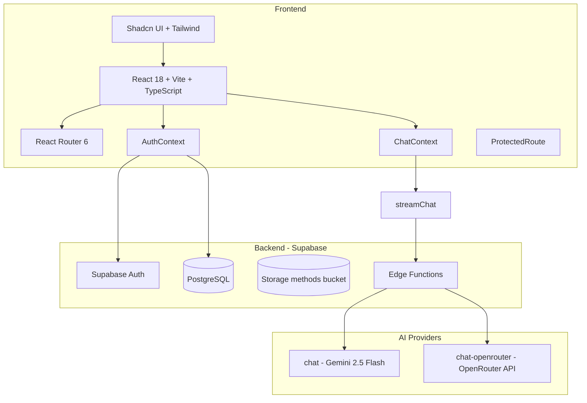

# Instant Web Chatter (Internium) — полная документация проекта

Этот документ описывает, что умеет проект, как он устроен, от чего зависит, как работает с Supabase (БД, RLS, Storage, Edge Functions) и какие ключевые потоки есть во фронтенде. По сути это расширенный README/архитектурное описание, которое должно дать новому разработчику полное понимание системы.

Важно: **схема Supabase в этом документе основана на SQL-интроспекции живой БД**, а не на `supabase/migrations/*`, потому что часть объектов могла быть создана через Supabase SQL Editor.

## Что умеет проект (функционально)

- **Авторизация и профили**: регистрация/вход через Supabase Auth, профиль пользователя, роли (`student`, `employee`, `admin`).
- **Чат с AI (стриминг)**:
  - Плавающий чат-виджет на всех страницах (основной интерфейс общения с AI)
  - Историческая страница `/chat` в текущем билде не используется (даёт 404), так как основной UX перенесён в виджет и практикум
  - Стриминговые ответы (SSE) через Supabase Edge Functions
  - Выбор провайдера: **Gemini** или **OpenRouter**
- **Методички** (`/methods`):
  - Поиск и фильтры (направление/уровень/формат)
  - Открытие/скачивание файлов из Supabase Storage
  - Поддержка переходов из практикума по ссылкам-глоссарию вида `{{термин|поисковый запрос}}` (подставляет `?search=...`)
- **Практикум** (`/practicum`):
  - Курсы -> уроки -> шаги (блоки)
  - Типы шагов: теория, квиз, задание с AI-проверкой, инфо-блок
  - **Прогресс** пользователя и блокировки (уроки и шаги открываются последовательно)
- **Админка** (`/admin`, только `role=admin`):
  - Управление пользователями/ролями
  - Управление методичками (CRUD + Storage upload)
  - Просмотр прогресса студентов
  - **Конструктор практикумов** (CRUD курсов/уроков/шагов + сортировка + публикация)

## Технологии и зависимости

### Frontend

- **React 18 + TypeScript + Vite**
- **React Router** (маршрутизация)
- **Tailwind + shadcn/ui + Radix UI** (UI)
- **Supabase JS** (`@supabase/supabase-js`) — Auth/DB/Storage
- **TanStack React Query** — подключён через `QueryClientProvider` (пока логика загрузки в основном через `useEffect` + `supabase`, но QueryClient уже есть)

### Backend (Supabase)

- **Postgres + RLS**
- **Edge Functions (Deno)** (`chat`, `chat-openrouter`, `list-models`)
- **Storage bucket** для файлов методичек

### AI

- **Gemini**: Edge Function `chat` использует `@google/generative-ai`
- **OpenRouter**: Edge Function `chat-openrouter` делает `fetch` в `https://openrouter.ai/api/v1/chat/completions`

### Архитектура (высокий уровень)

### Зависимости, которые установлены, но могут использоваться только в UI-обвязке

Некоторые пакеты присутствуют, но в бизнес-логике могут не использоваться напрямую (например `react-day-picker`, `recharts`, `embla-carousel-react`) — они могут быть частью shadcn компонентов (`src/components/ui/*`), даже если конкретные страницы их не рендерят сейчас.

Факты по коду:
- `react-markdown` в `src/` не используется (поиск по импорту не дал совпадений).
- `recharts`/`embla`/`react-day-picker` встречаются внутри `src/components/ui/*` (chart/carousel/calendar), но не обязательно используются страницами.

## Маршрутизация (routes)

Маршруты описаны в `src/App.tsx`.

- **Публичные**:
  - `/` — Home
  - `/login` — Login
  - `/auth/callback` — AuthCallback
  - `/about` — About
  - `*` — NotFound
- **Требуют логин** (через `ProtectedRoute`):
  - `/profile` — Profile
  - `/methods` — Methods
  - `/practicum` — Practicum
  - `/practicum/:courseSlug` — PracticumCourse
  - `/practicum/:courseSlug/:lessonSlug` — PracticumLesson
- **Только admin**:
  - `/admin` — Admin

## Supabase: подключение во фронтенде

Клиент создаётся в `src/integrations/supabase/client.ts` и берёт env:
- `VITE_SUPABASE_URL`
- `VITE_SUPABASE_PUBLISHABLE_KEY` (или `VITE_SUPABASE_ANON_KEY`)

Сессия хранится в `localStorage`, включены `persistSession` и `autoRefreshToken`.

## Supabase: схема БД (по SQL-интроспекции живой БД)

Ниже — таблицы `public` (RLS включён везде), ключи и краткое назначение.

### Таблицы и примерные количества строк

> Числа ниже ориентировочные и могут меняться по мере развития пилота.

- `profiles`: ~2
- `methods`: ~15
- `applications`: 0
- `user_progress`: ~9
- `practicum_courses`: 5 (включая общий базовый курс)
- `practicum_lessons`: 12
- `practicum_steps`: 49

### `profiles`

- PK: `id`
- FK: `profiles.id -> auth.users.id`
- Поля:
  - `full_name`
  - `avatar_url`
  - `role` (check: `student|employee|admin`) — access‑роль, используется для разграничения доступа (`student`/`admin`)
  - `specialty_role` — профессиональная роль трека (`developer`/`analyst`/`marketer`/`designer`/`tester`, `NULL` допустим до выбора)
  - `created_at`, `updated_at`

### `methods`

- PK: `id`
- Поля: `title`, `description`, `tags text[]`, `level` (beginner|intermediate|advanced), `direction` (ai|ml|neural|prompting), `file_url`, `file_name`, `file_size`, `icon_name`, `format`, `is_active`, `created_at`, `updated_at`

### `applications` (заявки)

Таблица в БД существует и защищена RLS, но **UI в админке удалён** (бизнес-функция выключена на уровне интерфейса).

### `user_progress`

Хранит прогресс по практикуму.

- Поля: `user_id`, `task_id`, `completed`, `completed_at`, `notes`, `created_at`, `updated_at`
- FK: `user_progress.user_id -> profiles.id`
- В практике используется формат `task_id = step_<uuid>` для шагов урока.

### Practicum таблицы

Иерархия: **course -> lesson -> step**.

- `practicum_courses`: курсы:
  - `slug`, `title`, `description`
  - визуальные поля: `icon_name`, `color`
  - учебные метаданные: `difficulty` (`easy` / `medium` / `hard`), `estimated_duration`
  - сервисные: `lessons_count`, `sort_order`
  - публикация: `is_published`
  - gating и таксономия:
    - `is_common_base` (boolean) — флаг единственного общего базового курса; поверх него есть частичный уникальный индекс, который гарантирует, что опубликован только один базовый курс
    - `course_category` (`common_base` / `role_track` / `optional` / `NULL`) — минимальная таксономия курсов практикума:
      - `common_base` — общий базовый модуль (для всех ролей)
      - `role_track` — ролевые треки по специальностям
      - `optional` — опциональные/углубляющие модули
      - `NULL` — временно неклассифицированные курсы (желательно не оставлять в актуальном MVP)
    - CHECK‑ограничение в БД связывает `course_category` и `is_common_base`:
      - `common_base` → `is_common_base = true`
      - `role_track` / `optional` → `is_common_base = false`
      - `NULL` — не проверяется (для обратной совместимости)
- `practicum_lessons`: уроки внутри курса (`course_id`, `slug`, `title`, `description`, `sort_order`, `is_published`, `created_at`, `updated_at`)
- `practicum_steps`: шаги урока (тип `step_type` + специализированные поля для theory/task/quiz/info)

Статистика по шагам:
- theory: 12
- task: 9
- quiz: 6
- info: 6

Примеры курсов (по данным БД):
- `ai-foundations` — «Основы AI для работы», общий базовый курс (`course_category = 'common_base'`, `is_common_base = true`), 4 урока про роль AI, хороший промпт, итеративное улучшение и проверку/поиск инструментов.
- `ai-for-developers` — «AI для разработчиков: практические сценарии», ролевой трек (`course_category = 'role_track'`), 7 уроков: разбор кода, отладка, оценка ответов AI, документация, декомпозиция задач, тест-кейсы, безопасность. Создаётся миграцией `20250316000000_seed_developer_role_track.sql`.
- `ai-for-analysts` — «AI для аналитиков: практические сценарии», ролевой трек (`course_category = 'role_track'`), 7 уроков: уточнение бизнес-вопросов, декомпозиция задач, поддержка SQL-логики, проверка выводов, коммуникация результатов, верификация гипотез, безопасное использование AI. Создаётся миграцией `20250317000000_seed_analyst_role_track.sql`.
- `ai-for-testers` — «AI для тестировщиков: практические сценарии», ролевой трек (`course_category = 'role_track'`), 7 уроков: уточнение задач на тестирование, генерация позитивных/негативных/граничных сценариев, критика идей AI, структурирование багрепортов, проверка покрытий, тестовая документация, безопасное использование AI в QA. Создаётся миграцией `20250318000000_seed_tester_role_track.sql`.
 - `ai-for-designers` — «AI для дизайнеров: практические сценарии», ролевой трек (`course_category = 'role_track'`), 7 уроков: уточнение дизайн‑задачи, генерация направлений и референсов, формулирование стиля и ограничений, поддержка мудбордов, объяснение решений и безопасное использование AI в дизайне. Создаётся миграцией `20250319000000_seed_designer_role_track.sql`.
 - `ai-for-marketers` — «AI для маркетологов: практические сценарии», ролевой трек (`course_category = 'role_track'`), 7 уроков: уточнение маркетинговых задач, генерация сообщений с учётом аудитории, улучшение слабого AI‑копирайтинга, структурирование идей кампаний, поддержка ресёрча и сравнений, подготовка сводок для стейкхолдеров и безопасное использование AI в маркетинге. Создаётся миграцией `20250320000000_seed_marketer_role_track.sql`.
- `prompting` (published)
- `neural-networks` (published)
- `ml-basics` (published)
- `privet` (not published)

### Завершение уроков и курсов

- **Шаг** считается выполненным, если для `task_id = step_<stepId>` в `user_progress` есть запись с `completed=true`.
- **Урок** считается завершённым, если все его интерактивные шаги (`step_type IN ('task', 'quiz')`) завершены.
- **Курс** считается завершённым, если для всех его уроков выполнено условие выше.

На фронтенде:
- в `PracticumCourse` уроки с полностью выполненными интерактивными шагами подсвечиваются зелёной карточкой с иконкой галочки;
- в `Practicum` завершённые курсы подсвечиваются зелёной карточкой; кнопка на карточке меняет текст:
  - «Начать практикум» — если прогресса нет;
  - «Продолжить курс» — если есть прогресс, но не все уроки завершены;
  - «Просмотреть курс» — если курс завершён.

## Supabase: RLS и политики (важно для доступа)

Все таблицы `public.*` имеют `rls_enabled=true`.

Ключевая функция:
- `public.is_admin()` — `SECURITY DEFINER` (используется в политиках как единый способ проверки админства без рекурсии RLS)

### Принципы доступа (сводно)

- `methods`:
  - читать могут все, но только `is_active=true`
  - админы могут читать всё и делать CRUD
- `practicum_*`:
  - читать могут все, но только опубликованное (`is_published=true`, иерархически)
  - админы могут читать всё и делать CRUD
- `profiles`:
  - пользователь читает/обновляет только свой профиль
  - админ читает/обновляет всё
- `user_progress`:
  - пользователь читает/пишет/удаляет только свой прогресс
  - админ может читать всё
- `applications`:
  - пользователь видит свои и может создавать/обновлять pending
  - админ видит/обновляет всё

## Практикум: прогресс, блокировки и ролевые треки

### Прогресс по шагам и блокировка внутри урока

- В `src/pages/PracticumLesson.tsx` прогресс по шагам урока хранится в `user_progress` с ключом `task_id = step_<stepId>`.
- Считается, что:
  - quiz завершён при правильном ответе;
  - task завершён при вердикте AI `[ЗАЧТЕНО]`; в `notes` сохраняется ответ пользователя.
- Внутри урока пользователь видит шаги **до первого невыполненного интерактивного** (quiz/task) включительно; следующие шаги скрыты/заблокированы.

### Блокировка уроков и вычисление статуса курса

- Внутри курса уроки открываются последовательно: следующий урок разблокируется только после завершения предыдущего (все интерактивные шаги выполнены).
- В `PracticumCourse` для каждого урока:
  - `isLessonCompleted` проверяет, что все интерактивные шаги помечены выполненными;
  - `unlockedLessonIds` содержит цепочку уроков до первого незавершённого;
  - финальная кнопка под списком уроков ведёт на первый незавершённый урок и меняет текст «Начать курс» → «Продолжить курс» → «Просмотреть курс» в зависимости от прогресса.
- В `Practicum` хук `usePracticumCourses(userId)` агрегирует прогресс по шагам во всех курсах и возвращает `completedCourseIds`, чтобы подсветить полностью завершённые курсы.

### Общий базовый курс и ролевые треки

- Функция `useCommonBaseStatus(userId)`:
  - находит опубликованный курс с `is_common_base = true`;
  - загружает его уроки и шаги;
  - вычисляет `isBaseCompleted` (все интерактивные шаги базового курса выполнены) и `hasBaseProgress` (есть хотя бы один выполненный шаг).
- На странице `/practicum`:
  - базовый курс отображается как отдельная карточка в блоке «Общий базовый модуль»;
  - **ролевые треки** (`course_category = 'role_track'`) видит только пользователь с выбранной `specialty_role`; список доступных курсов для роли задаётся в `src/config/specialtyRecommendations.ts`;
  - пока `isBaseCompleted = false`, все ролевые треки помечены как «Доступен после базового курса» и карточки заблокированы;
  - после завершения базового курса ролевые треки становятся доступны, а сам базовый курс подсвечивается зелёным как завершённый.

### Вспомогательные миграции для пилота

- `20250315000000_seed_common_base_course.sql` — создаёт общий базовый курс `ai-foundations` и все его уроки/шаги.
- `20250316000000_seed_developer_role_track.sql` — создаёт ролевой трек для разработчиков `ai-for-developers` с 7 уроками по спецификации.
- `20250316000002_seed_test_user_base_completed.sql` — утилитарный скрипт для пилота: помечает базовый курс завершённым для пользователя с заданным email (используется для тестирования ролевых треков без ручного прохождения базы).

## Supabase: триггеры и функции

Функции `public` (по SQL-интроспекции):
- `is_admin()` — security definer
- `handle_new_user()` — security definer (триггер на создание профиля при регистрации)
- `handle_updated_at()`, `handle_methods_updated_at()`, `handle_practicum_updated_at()` — поддержка `updated_at`
- `handle_progress_completion()` — логика заполнения `completed_at` при `completed=true`

Триггеры `public` (сводно):
- `profiles`: `on_profile_updated` -> `handle_updated_at()`
- `methods`: `on_methods_updated` -> `handle_methods_updated_at()`
- `applications`: `on_application_updated` -> `handle_updated_at()`
- `user_progress`: `on_progress_timestamp_updated` -> `handle_updated_at()`, `on_progress_updated` -> `handle_progress_completion()`
- `practicum_courses/lessons/steps`: `on_practicum_*_updated` -> `handle_practicum_updated_at()`

## Edge Functions и API

Фронтенд **не использует собственный REST backend**. Взаимодействие идёт через Supabase JS и Edge Functions.

### `streamChat()` (frontend)

Реализован в `src/utils/chatStream.ts`. Он:
- собирает `MentorContext` в строку (включая **критерии успеха** для заданий)
- отправляет POST в Edge Function
- читает SSE-стрим и отдаёт `delta` чанки в UI

### Edge Function: `chat` (Gemini)

- URL: `${VITE_SUPABASE_URL}/functions/v1/chat`
- `verify_jwt=false` (функция публично вызываема, но фронт всё равно передаёт `Authorization: Bearer <publishable key>`)
- Использует модель `gemini-2.5-flash`
- Добавляет `mode`-инструкции (`verify`, `discuss`, `explain`, `debug`) и `context` в системный промпт

### Edge Function: `chat-openrouter` (OpenRouter)

- URL: `${VITE_SUPABASE_URL}/functions/v1/chat-openrouter`
- `verify_jwt=true` (требует валидный JWT пользователя)
- Модель берётся из:
  1) `requestedModel` из тела запроса, или
  2) `OPENROUTER_MODEL` из env, или
  3) дефолт `google/gemini-2.5-flash`
- Делает proxy SSE напрямую (OpenRouter уже возвращает OpenAI-совместимый стрим)

### Edge Function: `list-models`

Сервисная функция, пытается проверить доступность известных Gemini-моделей.

## Практикум: как устроен прогресс и блокировки

### Прогресс по шагам

В `src/pages/PracticumLesson.tsx` прогресс хранится в `user_progress` с ключом `task_id = step_<stepId>`:
- quiz: при правильном ответе `completed=true` (при ошибочном ответе правильный вариант не раскрывается, студент может честно попробовать ещё раз)
- task: при `[ЗАЧТЕНО]` от AI `completed=true` и сохраняются `notes` (текст ответа пользователя)

### Блокировка шагов (внутри урока)

Показываются шаги до первого невыполненного интерактивного (quiz/task) включительно. Всё что дальше — скрыто/заблокировано.

### Блокировка уроков (внутри курса)

Внутри курса уроки открываются последовательно: следующий доступен только если предыдущий урок «завершён» (все интерактивные шаги выполнены).

## Админка: что в ней есть

Админ-панель (`/admin`) доступна только пользователям с ролью `admin` (проверяется через `ProtectedRoute` + `profile.role`). Внутри есть несколько вкладок:

- **Обзор**
  - Карточки-метрики:
    - «Всего пользователей» — общее количество записей в `profiles` (на момент проверки: 2).
    - «Методички» — количество записей в `methods` (на момент проверки: 15).
    - «Выполнено заданий» — количество записей с `completed=true` в `user_progress` (на момент проверки: 9).

- **Практикум (конструктор)**
  - Реализован в `src/components/admin/PracticumBuilder.tsx`.
  - Позволяет:
    - **Курсы:** список курсов (например, «Искусство промтинга», «Основы нейросетей», «Введение в машинное обучение», «Privet») с их `slug`, количеством уроков, длительностью, статусом публикации и сортировкой.
      - Операции: создать новый курс, редактировать существующий, скрыть/опубликовать, удалить, менять порядок.
    - **Уроки:** внутри выбранного курса — список уроков с порядком, статусом `is_published`, описанием. Можно добавлять/редактировать/удалять и менять порядок.
    - **Шаги:** внутри урока — список блоков (theory/task/quiz/info) с возможностью создавать, редактировать, удалять и менять порядок.

- **Пользователи**
  - Таблица с пользователями и их профилями:
    - Имя (`profiles.full_name`)
    - Роль (`student`/`admin`)
    - Дата регистрации
  - Роль можно менять через выпадающий список (кроме своего собственного профиля admin, который заблокирован для даунгрейда).

- **Методички**
  - Таблица всех записей в `methods`:
    - Название, направление (AI/ML/Нейросети/Промтинг), уровень (Начальный/Средний/Продвинутый), файл (имя файла), статус `is_active`.
  - Операции:
    - Создать новую методичку.
    - Редактировать существующую (теги, описание, направление, уровень, формат, иконку, файл).
    - Включать/выключать видимость (`Switch` для `is_active`).
    - Удалять (с удалением файла из Storage, если он есть).

- **Прогресс**
  - Блок агрегированной аналитики по `user_progress` и структуре практикума:
    - **Обзор по пользователям** — для каждого профиля видно:
      - сколько интерактивных шагов (quiz/task) завершено во всех курсах;
      - сколько курсов завершено;
      - завершён ли общий базовый курс (если он сконфигурирован в БД);
      - профессиональная роль (`specialty_role`).
    - **Обзор по курсам** — для каждого курса видно:
      - сколько пользователей начали курс (есть хотя бы один завершённый интерактивный шаг);
      - сколько пользователей его завершили (все интерактивные шаги завершены);
      - тип курса (общий базовый / ролевой трек / опциональный) по `course_category`.
    - **«Могут быть застрявшими»** — список пар пользователь–курс, где:
      - курс ещё не завершён;
      - есть хотя бы один завершённый интерактивный шаг;
      - последний завершённый шаг был `>= 7` дней назад (порог зашит константой в UI).
    - **Недавняя активность** — последние завершения шагов практикума:
      - пользователь, курс/урок, тип шага (quiz/task), статус, дата.
  - Ниже остаётся таблица сырых записей из `user_progress` с join на `profiles`:
    - Пользователь (имя из профиля)
    - Задание (`task_id`, например `step_<uuid>` или старый `prompt_practicum_1`)
    - Статус (бейдж «Выполнено» или «В процессе»)
    - Дата выполнения (`completed_at`) или `-`, если не заполнено
    - Заметки (например, текст промпта студента для заданий с AI-проверкой)
  - Вся аналитика строится на фронтенде из существующих таблиц (`practicum_courses`, `practicum_lessons`, `practicum_steps`, `user_progress`, `profiles`) без отдельного слоя событий.

### Как расширять типы блоков в будущем

Чтобы добавить, например, блок с картинками:
1) **БД**: расширить `practicum_steps` (новые поля, и/или новый `step_type` и связанные check constraints)\n
2) **Админка**: добавить новый тип в type picker, форму редактирования, превью\n
3) **Фронт урока**: добавить рендер нового типа в `PracticumLesson.tsx` (аналогично `TheoryStep`, `InfoStep`, `QuizStep`, `TaskStep`)\n

## Конфигурация окружения

### Frontend `.env`

Файл `.env` в репозитории игнорируется (`.gitignore`). Минимально нужно:

- `VITE_SUPABASE_URL`
- `VITE_SUPABASE_PUBLISHABLE_KEY` (или `VITE_SUPABASE_ANON_KEY`)

### Supabase secrets (Edge Functions)

- `GEMINI_API_KEY` — для `chat`
- `OPENROUTER_API_KEY` — для `chat-openrouter`
- `OPENROUTER_MODEL` — опционально
- `SITE_URL` — опционально (для заголовка `HTTP-Referer` на OpenRouter)

## Локальный запуск

1) Установить зависимости:
- `npm install`

2) Запустить dev:
- `npm run dev`

3) Supabase:
- применить миграции (если надо) через CLI или Dashboard\n
- задать secrets и задеплоить Edge Functions\n

## Проверка реального поведения через Playwright MCP

Playwright MCP подключён и использовался для обхода проекта в отдельном браузере (собственная сессия). Сценарий обхода включал:

- Логин/сессию в отдельном браузере (ты залогинился там под admin‑аккаунтом)
- `/methods` — поиск и просмотр карточек методичек
- `/practicum` и вложенные маршруты (`/practicum/prompting`, `/practicum/prompting/what-is-prompt`) — проверка загрузки курсов, уроков, блокировок и прогресса
- `/admin` — просмотр всех вкладок админ‑панели (Обзор, Практикум, Пользователи, Методички, Прогресс)
- `/` и переходы по навбару

## Verification Results (Playwright MCP, локальный runtime)

Краткие результаты обхода основного функционала через Playwright MCP при открытом локальном фронтенде (`http://localhost:8080`). Время загрузки измерено через `performance.getEntriesByType('navigation')` (millis):

- **Навигация / главная (`/`)**
  - Последняя навигация: `duration ≈ 203 ms`, `domContentLoaded ≈ 197 ms`, `loadEvent ≈ 203 ms`.
  - Страница загружается без ошибок (вижу хиро-блок, описания программы, CTA-кнопки «Подать заявку на стажировку» → `/practicum`, «О программе» → `/about`).
  - Навбар с ссылками на `/methods`, `/practicum`, `/about` и плавающий AI-ассистент присутствуют.

- **Методички (`/methods`)**
  - Навигация на `/methods`: `duration ≈ 291 ms`, `domContentLoaded ≈ 288 ms`, `loadEvent ≈ 291 ms`.
  - Страница успешно открывается (Playwright snapshot показывает заголовок «Методички и обучающие материалы», строку поиска, фильтры и карточки методичек с кнопками «Скачать»/«Открыть»).
  - Контент соответствует данным в БД (видны материалы по промтингу, нейросетям, ML, этике и т.д.).

- **Практикум**
  - Навигация на `/practicum`: `duration ≈ 226 ms`, `domContentLoaded ≈ 220 ms`, `loadEvent ≈ 226 ms`. Заголовок и «скелет» страницы появляются сразу, текст «Загрузка курсов...» держится до прихода списка курсов из Supabase.
  - Навигация на `/practicum/prompting`: `duration ≈ 226 ms`, `domContentLoaded ≈ 220 ms`, `loadEvent ≈ 226 ms`. Сначала показывается «Проверка доступа...», затем (по коду) подтягиваются уроки и прогресс; ошибок в логах нет.
  - Навигация на `/practicum/prompting/what-is-prompt`: `duration ≈ 226 ms`, `domContentLoaded ≈ 220 ms`, `loadEvent ≈ 226 ms`. На момент снимка виден текст «Загрузка урока...», после чего должны отрендериться шаги и прогресс-бар (Playwright не зафиксировал ошибок).

- **Админка (`/admin`)**
  - Навигация на `/admin` для admin-пользователя успешно открывает полноценную админ-панель: заголовок «Админ-панель», кнопка «Обновить», табы «Обзор / Практикум / Пользователи / Методички / Прогресс».
  - Вкладка **«Обзор»** показывает реальные цифры из БД (на момент замера: 2 пользователя, 15 методичек, 9 выполненных заданий практикума).
  - Вкладка **«Практикум»** показывает «Конструктор практикумов»: список курсов (Искусство промтинга, Основы нейросетей, Введение в машинное обучение, Privet), их slug, количество уроков, длительность, а также кнопки «Скрыть/Опубликовать», редактирование и удаление.
  - Базовое время навигации на `/admin` по метрикам браузера: `duration ≈ 208 ms`, `domContentLoaded ≈ 203 ms`, `loadEvent ≈ 208 ms`.

- **Чат-страница (`/chat`)**
  - Прямой переход на `/chat` в текущем билде ведёт на 404 («Oops! Page not found»), что отражено и в консоли (`404 Error: User attempted to access non-existent route /chat`).
  - Это соответствует тому, что основной пользовательский чат сейчас реализован как плавающий виджет (`FloatingChat`) и внутри практикума, а маршрут `/chat` либо удалён, либо ещё не добавлен в `App.tsx`.

В целом: навигация, методички и практикум работают в соответствии с описанной архитектурой. Фактические времена навигации для основных страниц сейчас находятся на уровне **≈200–300 ms** на локальном окружении; дополнительное время до полной отрисовки зависит от ответов Supabase (особенно для списков курсов/методичек/прогресса) и может использоваться как база для дальнейшей оптимизации (кэширование, React Query, оптимизация SQL и т.п.). 